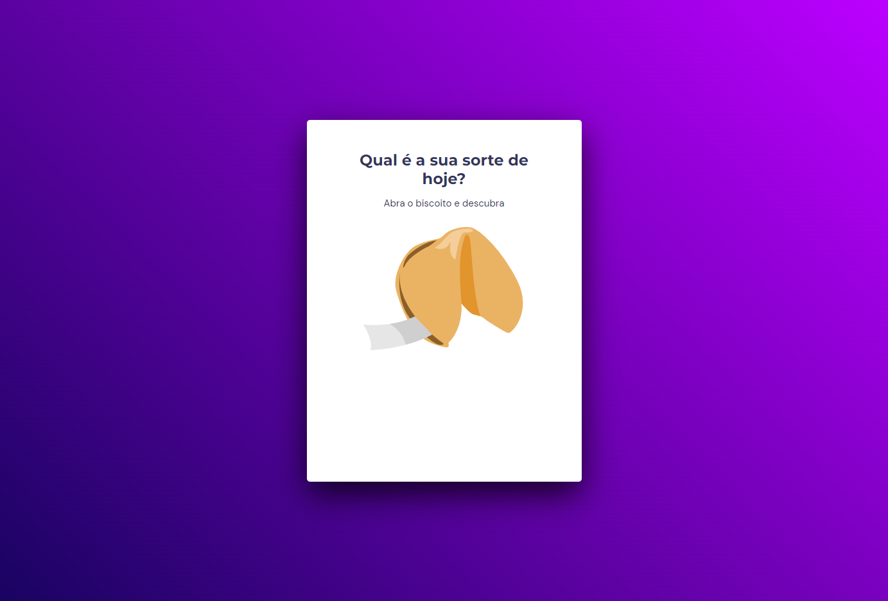

# Preview do projeto Biscoito da sorte

# Sobre o desafio
Neste desafio extra o objetivo é criar um jogo chamado Biscoito da Sorte, no qual o usuário, **a partir de um clique ou enter**, abre um biscoito com a sua sorte do dia. 
Nesta aula foi aplicado os conceitos:

- Estrutura de dados HTML
- Animações com CSS
- Funções no Javascript
- Manipulação da DOM
- Biblioteca JS Math()
- Funções *callback*
- Arrays
